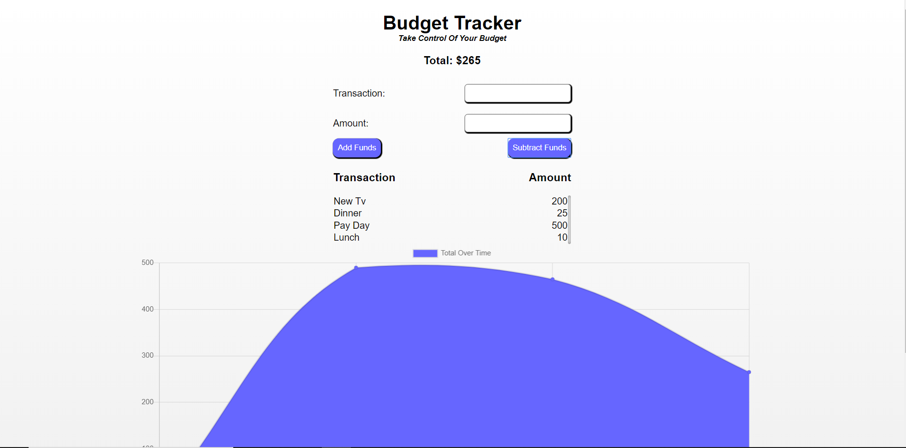

# Budget-Tracker
The Budget-Tracker allows you to take control of your budget. The Budget-Tracker is a Progressive Web App that allows user to utilize its functionality offline as well as online. The app uses the browsers Indexed Data Base as well as the cache to store server API routes and user input while a user is offline. The Budget-Tracker also uses Chartjs to visually display the budget data. Check out the completed project here: 

